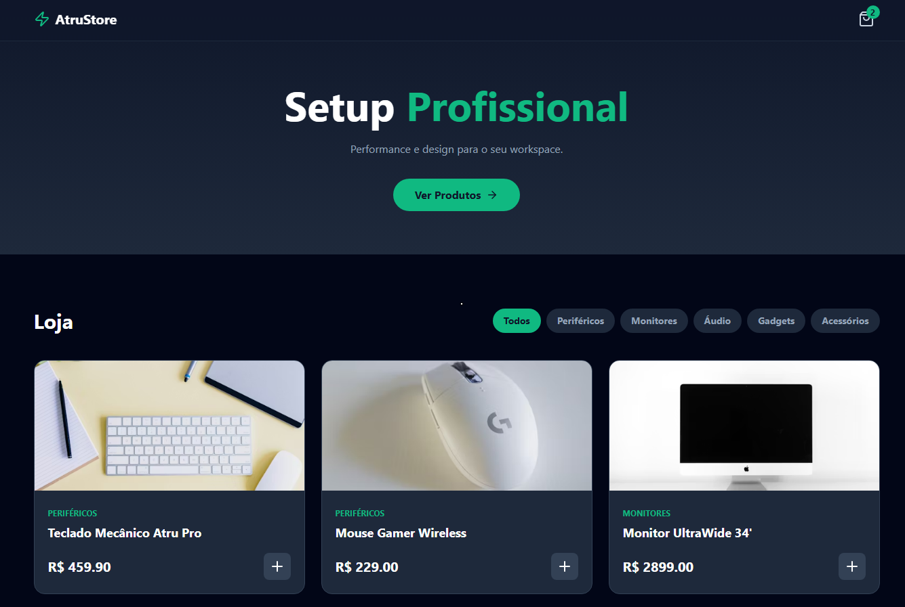

# ⚡ AtruStore - Modern E-commerce SPA



## 📖 Sobre o Projeto

O **AtruStore** é uma Single Page Application (SPA) de e-commerce focada em periféricos high-end e gadgets. O projeto foi desenvolvido para demonstrar competências em **Front-end Moderno**, focando em arquitetura limpa, componentização e performance.

A aplicação simula uma experiência completa de compra, incluindo navegação por categorias, carrinho de compras funcional com persistência de dados e design responsivo.

## 🚀 Tecnologias & Ferramentas

* **Core:** [React](https://reactjs.org/) (Hooks & Context API)
* **Build Tool:** [Vite](https://vitejs.dev/)
* **Estilização:** [Tailwind CSS](https://tailwindcss.com/) (v3)
* **Ícones:** [Lucide React](https://lucide.dev/)
* **Gerenciamento de Estado:** Context API + LocalStorage Custom Hook

## ✨ Funcionalidades

* 🛒 **Carrinho Inteligente:** Adição, remoção e ajuste de quantidade com atualização em tempo real.
* 💾 **Persistência de Dados:** O estado do carrinho é salvo no `LocalStorage`, mantendo os itens mesmo após atualizar a página.
* 🔍 **Filtragem Dinâmica:** Filtro de produtos por categorias (Teclados, Mouses, etc.) sem recarregamento.
* 📱 **Design Responsivo:** Layout fluido que funciona em Desktop e Mobile (Mobile-first approach).
* 🎨 **Dark Mode UI:** Interface moderna com estética "Dark Neon".

## 🔧 Como Rodar Localmente

Siga os passos abaixo para testar o projeto em sua máquina:

```bash
# 1. Clone o repositório
git clone [https://github.com/SEU-USUARIO/atrustore.git](https://github.com/SEU-USUARIO/atrustore.git)

# 2. Entre na pasta do projeto
cd atrustore

# 3. Instale as dependências
npm install

# 4. Inicie o servidor de desenvolvimento
npm run dev