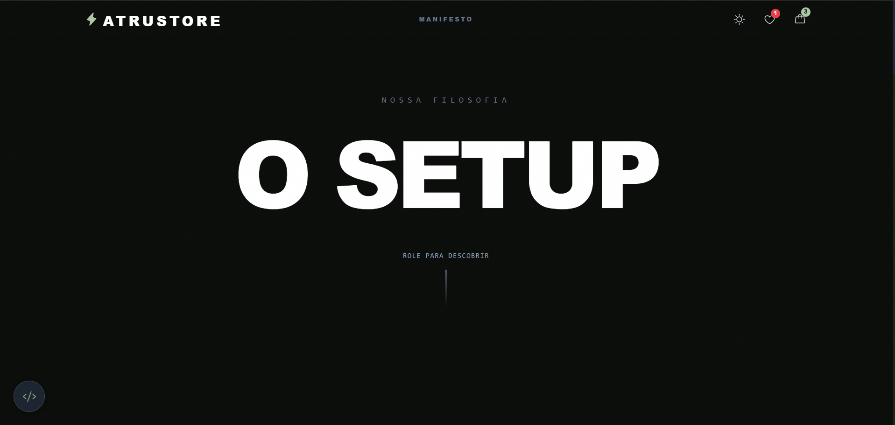

# ⚡ AtruStore — High Performance Peripherals

<p align="center">
  
  
  
  
  
</p>

O **AtruStore** é um e-commerce especializado em hardware e periféricos de alto nível, desenvolvido como um case de **Portfólio Front-end Premium**. O projeto foi construído focando em performance de renderização, imersão visual e excelência técnica arquitetural, utilizando o que há de mais moderno no ecossistema React.
  
<p align="center"><i>*Para visualizar com perfeição, navegue também pelo modo Escuro.</i></p>
---

## 🌟 Destaques & Diferenciais (Premium Portfolio)

Este projeto vai além de um CRUD básico, incorporando *features* avançadas fortemente exigidas por recrutadores e engenheiros seniores:

- **🌗 Tema Dinâmico Inteligente**: Uso massivo de "Glassmorphism", Off-Black nativos e contrastes absolutos que descansam a visão (Premium Dark Mode).
- **💳 Checkout Holofgráfico 3D**: Renderização dinâmica de validação de pagamentos que simula física 3D real usando leitura de focos no cartão.
- **✨ Scroll-Telling & Microinterações**: Utilização agressiva de `framer-motion` para transições encadeadas, "Hotspots" interativos de setups de mesa que disparam o carrinho, e Parágrafos em Landing Page (Manifesto) guiados pela barra de rolagem matemática.
- **💾 Persistência de Estado Modular**: Gerenciamento robusto via Context API protegendo compras em andamento de reloads bruscos via LocalStorage.

---

## 🚀 Funcionalidades Principais  

- **🛒 Carrinho Dinâmico:** Adição, remoção e cálculo estrito de finanças e quantidades em tempo real usando formatação de moedas nativa (`Intl.NumberFormat`).  
- **❤️ Wishlist (Favoritos):** Hub interativo rápido para salvar produtos cobiçados.
- **🔍 Filtro e Ordenação Lógica:** Motor de busca instantâneo integrado com filtro de categorias baseadas em Tags e ordenação de preço ascendente e descendente.  
- **📦 Detalhes do Produto (SPA):** Geração dinâmica de rotas usando parâmetros puros com React Router Dom.  
- **🔔 Feedback de Ações:** Sistema limpo e não-intrusivo de Toasts integrados via biblioteca `sonner`.  

---

## 🛠️ Stack Tecnológica Completa

| Tecnologia | Aplicação Principal no Projeto |
| :--- | :--- |
| **React 18** | Árvores modulares, Hooks, Custom Contexts e React Router DOM. |
| **TypeScript** | Tipagem estática forte, prevenindo *Runtime Errors* de atributos e Null Checks. |
| **Tailwind CSS** | Design *utility-first* 100% responsivo, *Dark Mode* integrado e personalização profunda. |
| **Framer Motion** | Físicas realísticas, Layout Animations (AnimatePresence) e controles em eixos. |
| **Vite** | HMR hiper veloz e empacotamento otimizado na versão de Produção. | 
| **Lucide React** | Matriz consistente e leve de SVGs renderizáveis e iconografia limpa. |

---

## ⚙️ Como Executar o Projeto Localmente

1. **Clone o repositório em sua máquina:**
```bash
git clone https://github.com/AtruDev/AtruStore.git
```

2. **Instale cuidadosamente as dependências:**
```bash
npm install
```

3. **Inicie o servidor de desenvolvimento (HMR):**
```bash
npm run dev
```

---

<p align="center">Desenvolvido com sofisticação por <strong><a href="https://github.com/AtruDev" target="_blank">AtruDev</a></strong></p>
